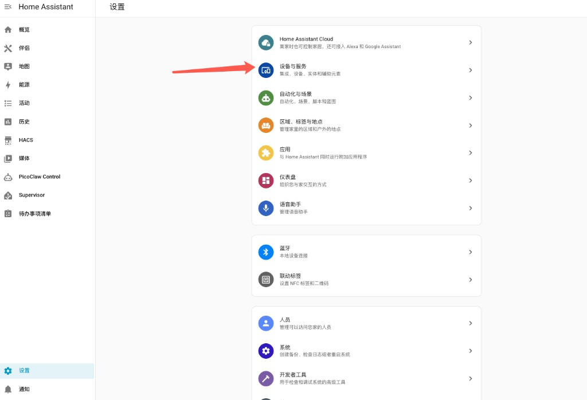
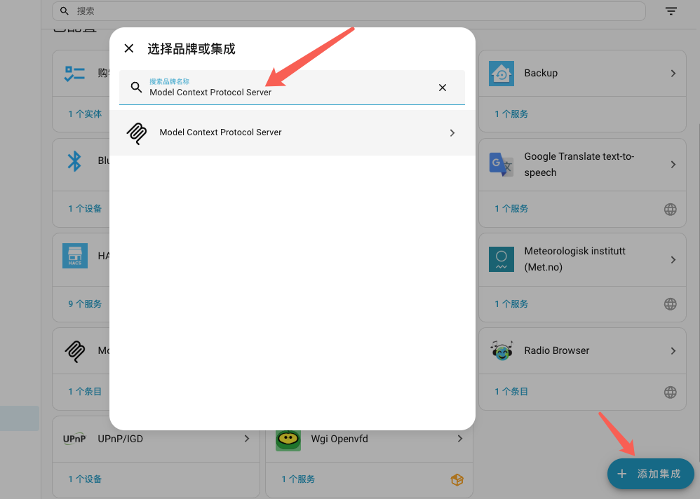
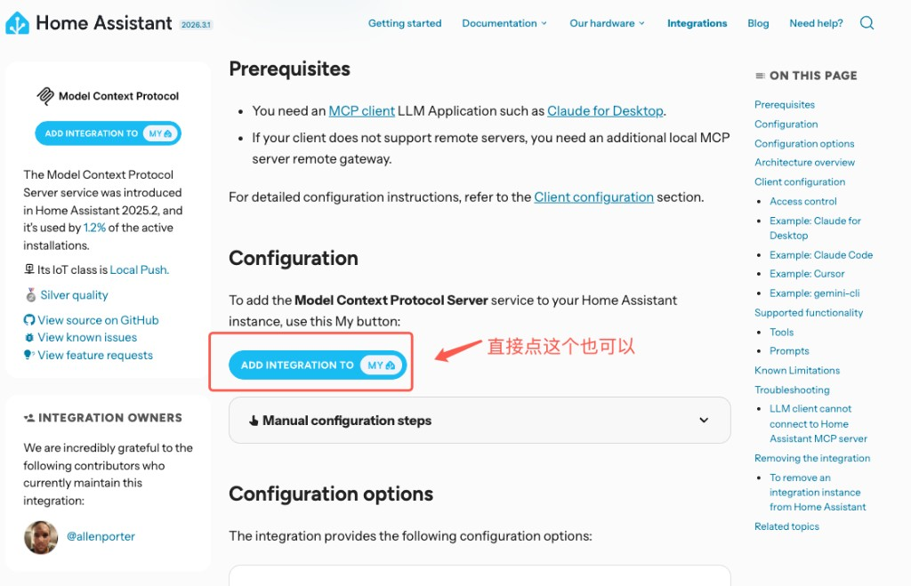
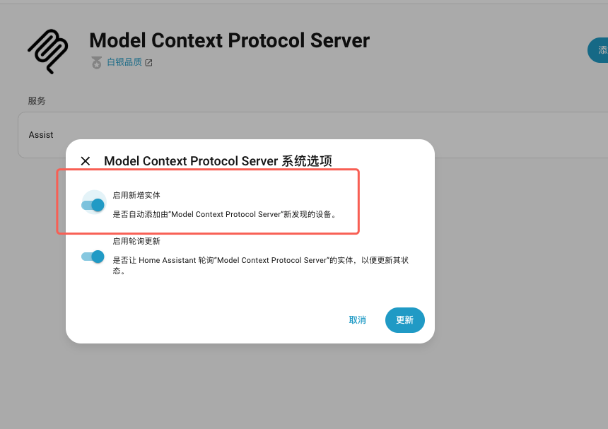
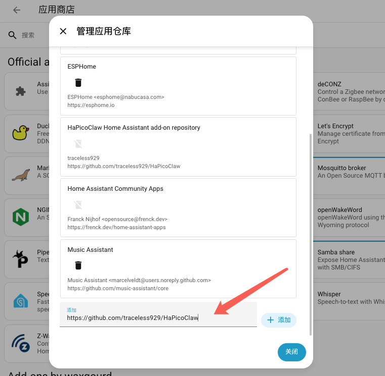
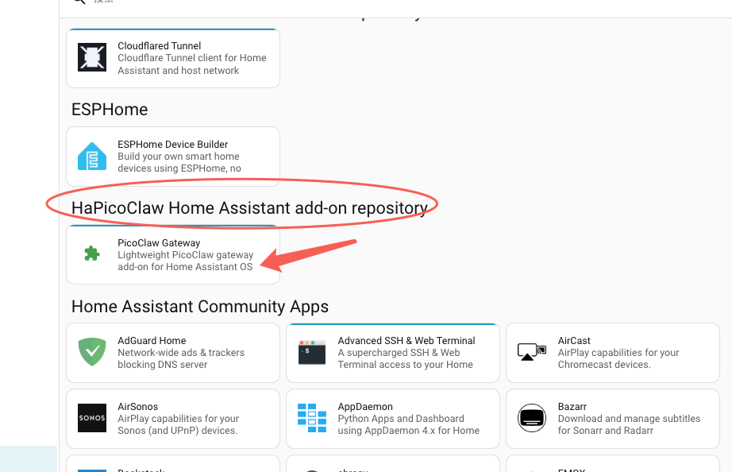
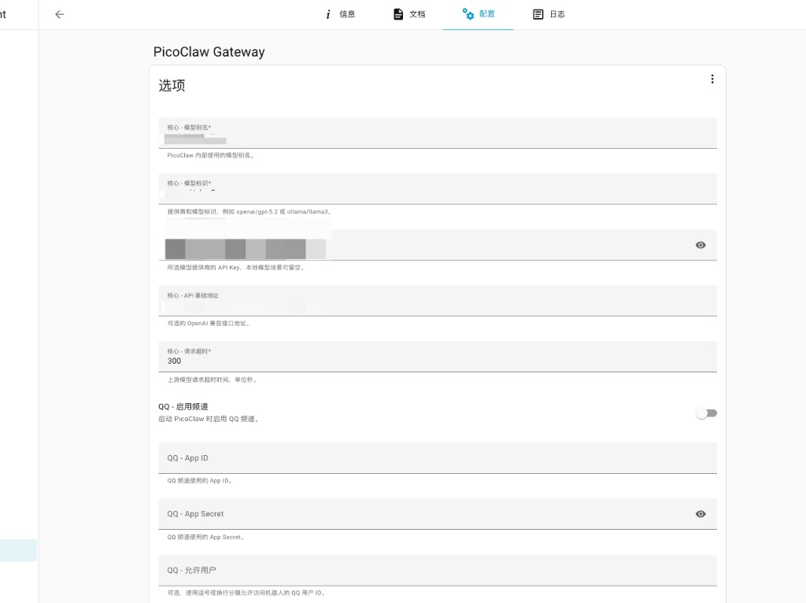
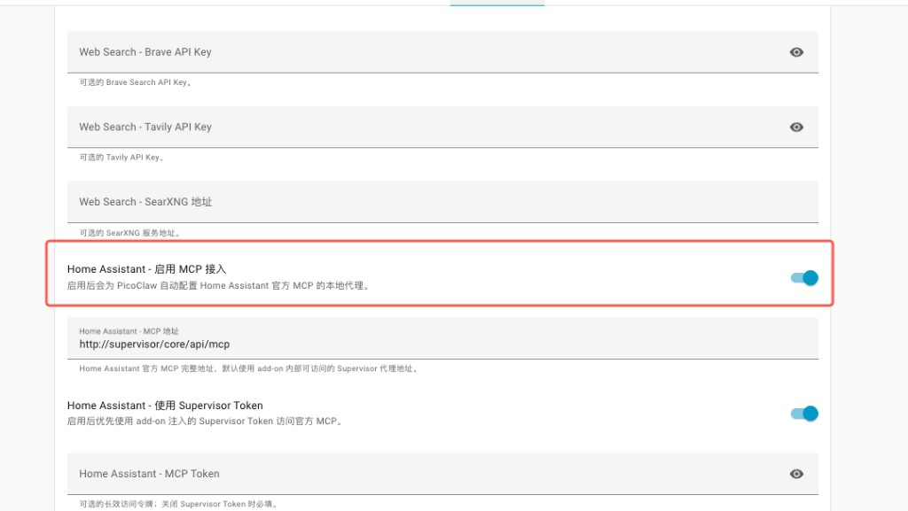
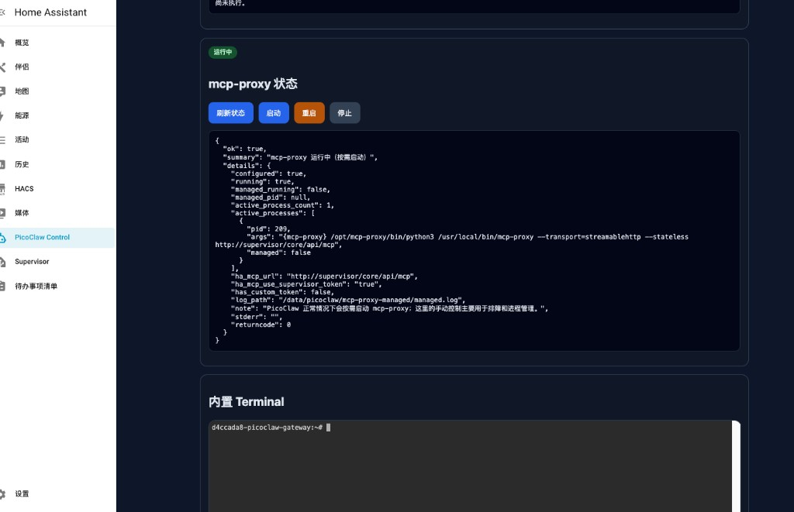
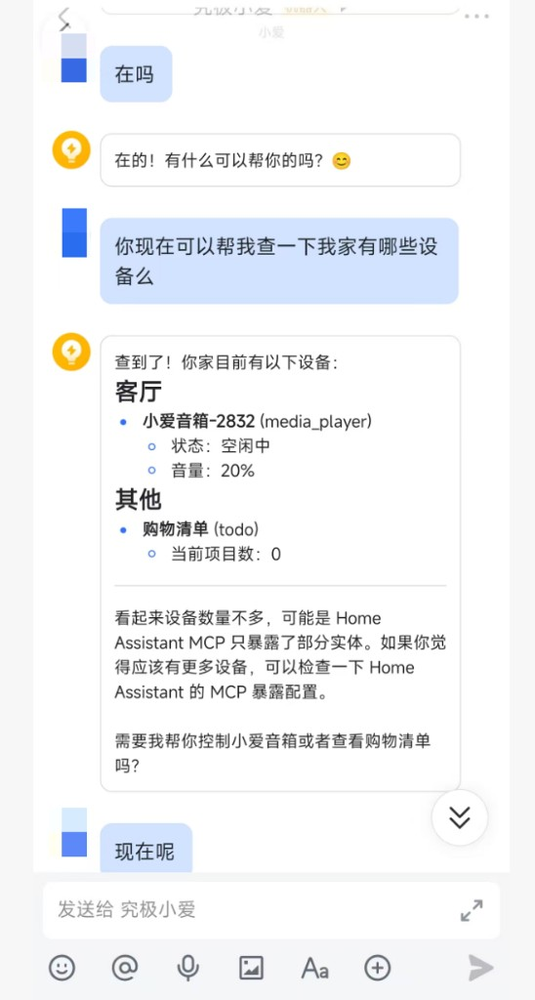

# PicoClaw Gateway Quick Start

> Assumption: Home Assistant OS is already installed and you can access the Home Assistant frontend.

Related projects and docs:

- Home Assistant official MCP: <https://www.home-assistant.io/integrations/mcp_server/>
- `mcp-proxy`: <https://github.com/sparfenyuk/mcp-proxy>
- PicoClaw: <https://github.com/sipeed/picoclaw>

## Architecture at a glance

This add-on uses the "official MCP + local bridge" model:

```text
Home Assistant mcp_server (/api/mcp)
        ->
      mcp-proxy
        ->
PicoClaw tools.mcp server
        ->
  PicoClaw Gateway / Agent
```

In practice, that means:

- Home Assistant official `mcp_server` exposes the MCP endpoint
- `mcp-proxy` bridges the official `Streamable HTTP` MCP transport into local `stdio`
- PicoClaw consumes the local MCP process through its native `tools.mcp` configuration

## Before you start

Please confirm:

- Home Assistant OS is already running
- You can open `Settings` in Home Assistant
- Your device architecture is `aarch64`
- You already have an LLM API key, or a compatible local model endpoint for PicoClaw

## Step 1: Install the official Home Assistant MCP integration

1. Open the Home Assistant frontend.
2. Go to `Settings -> Devices & Services`.
3. Click `Add Integration`.
4. Search for `Model Context Protocol Server`.
5. Install it and allow it to control Home Assistant.

If your browser is already logged into Home Assistant, you can also use this one-click badge:

[](https://my.home-assistant.io/redirect/config_flow_start?domain=mcp_server)









After installation, do one more important step:

1. Open the entity exposure page in Home Assistant.
2. Expose the entities that PicoClaw should be able to read or control.

If an entity is not exposed:

- PicoClaw may not see the corresponding MCP tools
- Home Assistant may reject related actions

## Step 2: Install this add-on

1. Add this repository as a Home Assistant add-on repository.
2. Open the `PicoClaw Gateway` add-on from this repository.
3. Click install.

If you want to add this repository to Home Assistant directly, you can also use this badge:

[](https://my.home-assistant.io/redirect/supervisor_add_addon_repository/?repository_url=https%3A%2F%2Fgithub.com%2Ftraceless929%2FHaPicoClaw)

If GitHub access is slow in your network region, you can also use this mirror-based repository link:

[](https://my.home-assistant.io/redirect/supervisor_add_addon_repository/?repository_url=https%3A%2F%2Fgh-proxy.org%2Fhttps%3A%2F%2Fgithub.com%2Ftraceless929%2FHaPicoClaw.git)

After installation, do not start it yet. Configure it first.





## Step 3: Fill in the add-on configuration

A minimal working configuration usually includes:

- `model_name`
- `model`
- `api_key`
- `api_base` (optional, but common when using a custom OpenAI-compatible endpoint)
- `ha_enabled=true`
- `ha_mcp_url=http://supervisor/core/api/mcp`
- `ha_mcp_use_supervisor_token=true`
- `ha_mcp_token=` empty

Recommended minimal example:

```yaml
model_name: "gpt-5.2"
model: "openai/gpt-5.2"
api_key: "YOUR_API_KEY"
api_base: ""
ha_enabled: true
ha_mcp_url: "http://supervisor/core/api/mcp"
ha_mcp_use_supervisor_token: true
ha_mcp_token: ""
```

Field notes:

- `ha_mcp_url`
  The default `http://supervisor/core/api/mcp` is recommended for HAOS add-on internal access.
- `ha_mcp_use_supervisor_token`
  When set to `true`, the add-on prefers the injected `SUPERVISOR_TOKEN`.
- `ha_mcp_token`
  If you do not want to rely on `SUPERVISOR_TOKEN`, disable the previous option and provide a long-lived access token.
- `api_base`
  Use this if you are connecting through a custom OpenAI-compatible endpoint such as a relay, self-hosted proxy, or local compatible gateway. If you want to use the model's default upstream endpoint, leave it empty.

When should you provide `ha_mcp_token` manually:

- You explicitly want to use a long-lived Home Assistant token
- You do not want to rely on Supervisor token injection
- You are using an external HA URL instead of the internal add-on URL





## Step 4: Start the add-on

1. Save the configuration.
2. Start the `PicoClaw Gateway` add-on.
3. Wait until startup completes.

At startup, the add-on will:

- Generate PicoClaw runtime `config.json`
- Start PicoClaw `gateway`
- Let PicoClaw launch `/usr/bin/ha-mcp-proxy-launcher` when MCP is needed
- Have `ha-mcp-proxy-launcher` call `mcp-proxy` against the official `/api/mcp`

## Step 5: Open the control page and verify the basics

After startup, open:

- `PicoClaw Control`

Recommended verification order:

1. Check `mcp-proxy status`
   You should see status details, and you can manually start/stop/restart it if needed
2. Click `Check HA API`
   It should return success
3. Click `Check Supervisor API`
   It should return success
4. Open the built-in `Terminal`
   The page should render correctly without garbled output

If you want to inspect the generated config in Terminal:

```bash
cat /data/picoclaw/.picoclaw/config.json
```

The following image shows the control page layout, `mcp-proxy` status, and the diagnostics area in one view:



## Step 6: Verify that MCP is actually usable

Passing the control page checks only proves that:

- the add-on starts correctly
- HA API and Supervisor API are reachable
- `mcp-proxy` can be managed

To verify that Home Assistant MCP is truly usable by PicoClaw, run a real functional test:

1. Send a request to PicoClaw through one of your enabled channels
2. Ask it to read the state of an exposed entity
3. Or execute a low-risk action, such as turning on a test light

Recommended first tests:

- A read action, such as "Is the living room light on?"
- A low-risk control action, such as "Turn on the test light"

The following screenshot shows a real chat result where PicoClaw successfully reads exposed Home Assistant devices through MCP:



If this fails, check in this order:

1. Is `Model Context Protocol Server` installed in Home Assistant
2. Is the target entity exposed to the official MCP integration
3. Is `ha_mcp_url` correct
4. Are `ha_mcp_use_supervisor_token` / `ha_mcp_token` configured correctly
5. Is `mcp-proxy` healthy in the control page

## Common questions

### 1. `mcp-proxy` shows as not running

That is not always a problem.

Reason:

- PicoClaw usually launches MCP processes on demand
- So if no Home Assistant MCP tool has been used yet, `mcp-proxy` may not be running at that moment

For debugging:

- You can click `Start` in the control page
- Then check whether the status changes to running

### 2. HA API works, but PicoClaw still cannot control devices

Typical reasons:

- The official MCP integration is not installed
- The entity is not exposed to MCP
- You are testing the wrong entity
- The token configuration is incorrect

### 3. Where should I look first

Recommended troubleshooting order:

1. Is the official Home Assistant MCP integration enabled
2. Is the target entity exposed
3. Is the add-on configuration correct
4. What does `mcp-proxy status` show in `PicoClaw Control`
5. What do the add-on logs say

## Screenshot coverage

This guide now includes:

1. Home Assistant `Settings -> Devices & Services`
2. Adding the integration and searching for `Model Context Protocol Server`
3. The official documentation install entry
4. The official MCP integration options page
5. Add-on repository setup and the `PicoClaw Gateway` entry
6. The full add-on configuration page plus the Home Assistant MCP related fields
7. `PicoClaw Control` with `mcp-proxy` status

If you want to make it even more detailed later, the most useful extra screenshots would be:

- The entity exposure page
- A dedicated successful `HA API` result screenshot
- A dedicated successful `Supervisor API` result screenshot
